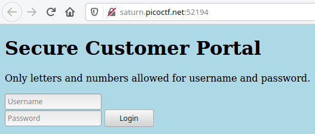

picoCTF: Local Authority
========================

Another challenge form picoCTF 2022 worth 100 points:

    **Description:**

    Can you get the flag? Go to this `website <http://saturn.picoctf.net:52194/>`_
    and see what you can discover.

    **Hint:**

    How is the password checked on this website?

**Solution:**

When you go to the website, you find the following login screen:

To find out more about the inner workings of the website, we look at the source
code (right-click on the page) and find the following:

.. code:: html

    <!DOCTYPE html>
    <html lang="en">
    <head>
        <meta charset="UTF-8">
        <meta name="viewport" content="width=device-width, initial-scale=1.0">
        <meta http-equiv="X-UA-Compatible" content="ie=edge">
        <link rel="stylesheet" href="style.css">
        <title>Secure Customer Portal</title>
    </head>
    <body>

        <h1>Secure Customer Portal</h1>

    
Only letters and numbers allowed for username and password.

        <form role="form" action="login.php" method="post">
        <input type="text" name="username" placeholder="Username" required
        autofocus> 
        <input type="password" name="password" placeholder="Password" required>
        <button type="submit" name="login">Login</button>
        </form>
    </body>
    </html>

Nothing visible at first sight. We dive deeper and look at the files
``style.css`` and ``login.php``. There is nothing special in ``style.css``, so
we focus on ``login.php``:

.. code:: javascript

    <!DOCTYPE html>
    <html lang="en">
    <head>
        <meta charset="UTF-8">
        <meta name="viewport" content="width=device-width, initial-scale=1.0">
        <meta http-equiv="X-UA-Compatible" content="ie=edge">
        <link rel="stylesheet" href="style.css">
        <title>Login Page</title>
    </head>
    <body>
        
        
        

        
        <form hidden action="admin.php" method="post" id="hiddenAdminForm">
        <input type="text" name="hash" required id="adminFormHash">
        </form>
        
        
        
    </body>
    </html>

Three further files are referenced in this document: ``style.css``,
``admin.php`` and ``secure.js``, and there is some JavaScript code included in
the website directly (starting in line 19 with ``<script type="text/javascript">``.

The function ``filter`` obviously checks if the entered field contains only
allowed letters. The JavaScript code following the function definition reads
the entered values and passes them on to a function called ``checkPassword()``
which is not defined in this document. Since we are looking for JavaScript
code, we look into ``secure.js`` first and find the following:

.. code:: javascript

    function checkPassword(username, password)
    {
        if( username === 'admin' && password === 'strongPassword098765' )
        {
            return true;
        }
        else
        {
            return false;
        }
    }

Okay, that was not difficult. The login credentials for the website are

``username: admin``

``password: 'strongPassword098765'``

If we copy the password, go back to the login screen, enter the password
together with the username ``admin``, we get the flag:

``picoCTF{j5_15_7r4n5p4r3n7_6309e949}``

.. author:: default
.. categories:: none
.. tags:: none
.. comments::
