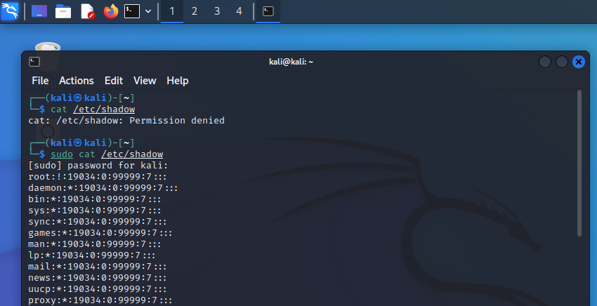
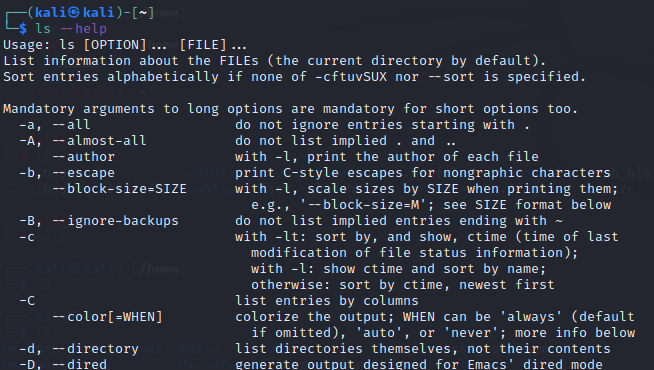
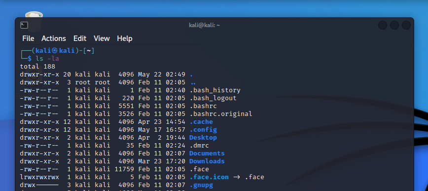
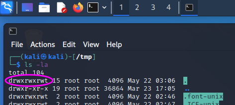
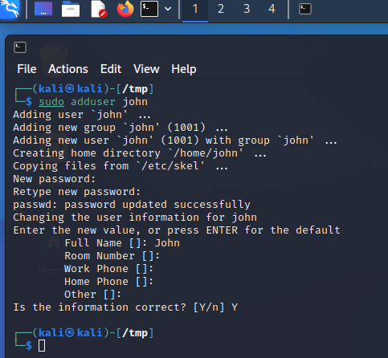
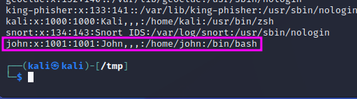
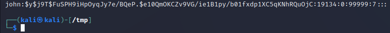
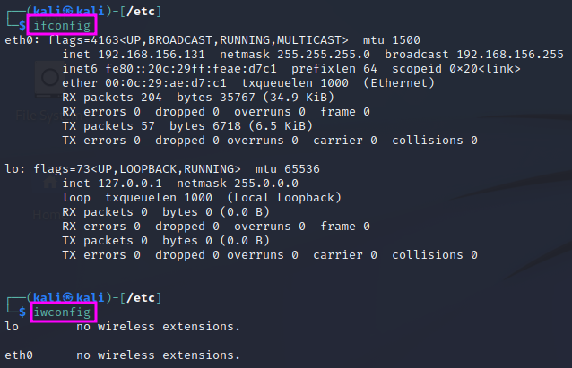
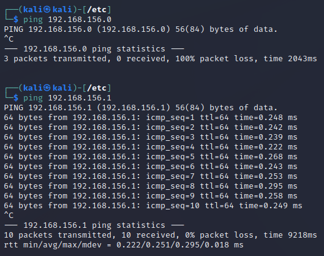
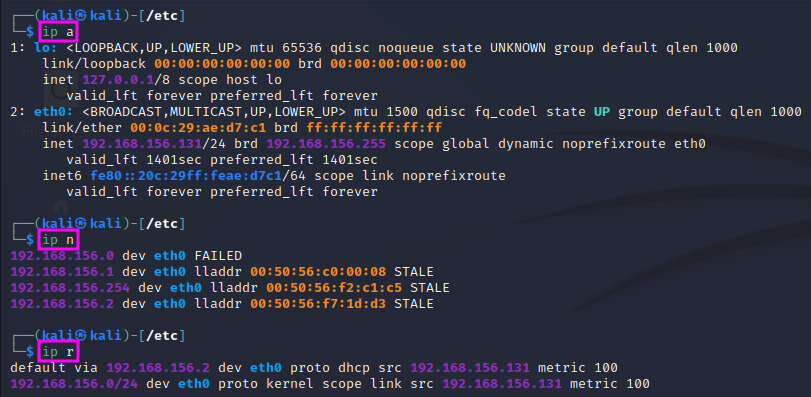

Introduction to Linux
=====================
The following notes are based on TCM Security's 'Practical Ethical Hacking'.
They refer to the Kali Linux operating system.

.. more::

Exploring Kali Linux
--------------------
Kali Linux is a Linux distribution specifically put together for ethical
hacking. It is based on Debian. The structure of the installed hacking tools is
ordered in the way a penetration test is typically conducted from information
gathering at the beginning to report writing at the end.

Sudo Overview
-------------
In earlier versions of Kali, there was an administrator account called "root",
which had all privileges, which again posed some security risks. Now a user
named "kali" with limited access rights is provided by default, which must use
a command called "sudo" (short for "super used do") to elevate the user rights
temporarily to execute a specific command.

**Example:** ``cat /etc/shadow`` will not work with normal access rights.
Instead, ``sudo cat /etc/shadow`` works, but has to be member of a sudo'ers
group and enter one's password.

``sudo su`` will permanently switch user (su) to root, but this is not
best security praxis and therefore not recommended for general work. One should
use ``sudo`` instead and just change to root if the situation requires. If one
opens a new tab from a terminal window with root, the user of the new tab will
be kali again.

Navigating the File System
--------------------------
In Linux you can -- just as in Windows -- use a GUI to navigate around the
filesystem, but as a pentester you will often work in a terminal window.

Linux is case sensitive, i.e. "folder", "Folder" and "FOLDER" are three
distinct names!

.. table:: Linux file system navigation
   :widths: auto

   =========================== ====================================================
    Command                                 Function
   =========================== ====================================================
    pwd                         Print working directory
    cd <dir>                    Change directory to <dir>
    cd ..                       Change to parent directory
    ls or ls <dir>              List contents of current directory or of <dir>
    mkdir <dir>                 Make a directory named <dir> in the current folder
    cp <source> <dest>          Copy file <source> to <dest>
    mv <source> <dest>          Move **or** rename file <source> to <dest>
    rm <file>                   Remove file <file>
   =========================== ====================================================

The TAB key can be used to complete file names. If the file name is not
unambiguous yet, hitting the TAB key twice will display a list with the
possible files that match what has been entered so far. The UP and DOWN arrow
keys can be used to navigate through the history of commands entered in the
terminal window, so that commands that are used several times do not have to be
typed in again and again.

One can reference folders beginning with the root directory (/). It is not
necessary to navigate to the respective directory first before, e.g. a ls
command is executed. The ~ is a shortcut for the current user's home folder.
Just entering ``cd`` without specifying a folder will change into the user's
home directory.

Hidden files and folders are displayed with ``ls -la``. Hidden
files and folders have names that begin with a period (e.g. ``.bashrc``).

To locate a file in the filesystem, one can use the ``locate`` command, etc.
``locate bash``, which displays all files that have bash in their filename. It
might be necessary to update the database which is used for the locate command
with ``sudo updatedb``.

To change the password, use the ``passwd`` command. You have to enter the old
password first and then the new password twice.

Linux systems provide manual (man) pages for every command. These man pages can
be displayed by ``man <command>``. Part of this information is often also
provided if one adds the command line switch ``--help`` to the command, e.g.
``ls --help``.

Users and Privileges
--------------------
An ``ls -la`` command shows the access rights to files and subfolders in the
leftmost column of the command's output:

The leftmost character ('d' or '-') tells us if the respective item is a
directory ('d') or a file ('-'). The following 9 characters indicate the right
to read ('r'), write ('w') or execute ('x') the respective file for the owner
of the file, the owner's group and any other user. For penetration test, the
``/tmp`` folder is oftentimes used to upload exploits since the tmp folder
gives full access rights to every user. A pentester will also look for other
files with insecure configurations that may offer a route to gain higher access
rights.

To change access rights, the ``chmod`` command is used, followed by 'u' for
user, 'g' for group or 'o' for others and a '+' or '-' and the permissions
('r', 'w', 'x') that shell be set or revoked.

**Example**: ``chmod u+x <filename>`` makes the file executable. It is also
possible to modify several settings at a time, e.g. with ``chmod ug+rw, o-x
<filename>``

Users can be added using the ``sudo adduser <name>`` command.

When the user has been created, it will show up at the end of the ``/etc/passwd``
file. This file used to include the passwords (or hashes of the same), but that
is not the case any more. A pentester can use access to this file to learn which
users are present on the respective system, e.g. to use them to hack into SSH
with their user name.

The password hashes are stored in the file ``/etc/shadow``, which has
restricted access rights. If one can get access to the password hashes, it
might be possible to crack the password with suitable tools, e.g. hashcat.

One can switch to another user account with the ``su`` (switch user) command,
e.g. ``su john``. If a user other than root shall be able to change
permissions, that user has to be in the sudo'ers group (or file, respectively).
``sudo <command>`` will execute the respective command with root access rights.

Common Network Commands
-----------------------
The configurations of the installed network interface cards (NIC) and wireless
network adapters can be displayed with the ``ifconfig`` and ``iwconfig``
commands. The ``ifconfig`` command is Linux' version of Windows' ``ipconfig``
command.

The ``ping <IP address>`` command is used to try if a connection to a certain
IP address can be established. If the connection cannot be established for some
reason, the attempt will time out after some time, and an error message will be
displayed. If the sought IP address exists, the connection is not broken and the
machine with the sought IP does not block ping (ICMP) traffic, a report with the
return time will be displayed for each package:

The ping command runs indefinitely, one has to stop it hitting <Ctrl> + <C>.
When it is stopped, it will display some statistical information.

The ``arp -a`` command shows a list of the stored IP connections, i.e. a table
relating IP addresses (layer 3) with MAC addresses (layer 2). ARP stands for
Address Resolution Protocol.

Open sockets on the machine can be displayed with ``netstat -ano``.

The system's IP routing table can be displayed with the ``route`` command.

**UPDATE:** The commands above are becoming deprecated. Instead of ``ifconfig``,
``arp`` and ``route``, the new ``ip`` command can be used. ``ip a`` shows the network
adapter settings (replacing ``ifconfig``), ``ip n`` (n for neighbours) shows
the ARP table (replacing arp), and ``ip r`` (r for routes) shows the routing
table (replacing route).

Installing and Updating Tools
-----------------------------
To update Kali Linux, use ``sudo apt update`` to update the database with the
latest released software package for the used distribution, followed by ``sudo
apt upgrade`` to actually download and install the packages that are not up to
date. Note that the latter step might easily take a while! Linux will display
the additional amount of harddisk space needed and ask if the updates shall be
carried out. After the update is finished, ``sudo apt autoremove`` can be used
to remove packages that are no longer used to free disk space again.

When you want to install new software packages from Github, it is good practice
to install them in the ``/opt`` folder:

#. ``cd /opt``
#. ``git clone <link to git>``
#. Follow the installation instructions on the github page.

Viewing, Creating and Editing Files
-----------------------------------
dsda
    

.. author:: default
.. categories:: none
.. tags:: none
.. comments::
