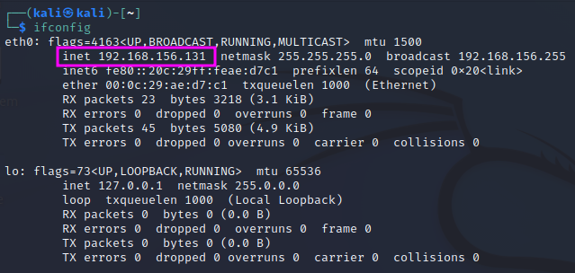
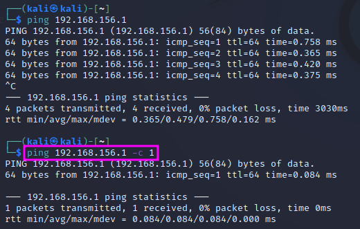
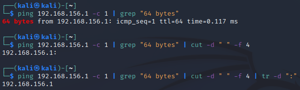

Scripting with Bash
===================
This post is based on TCM Sec's "Practical Ethical Hacking" course. It is the
last topic in the "Introduction to Linux" chapter.

.. more::

This chapter culminates in the following bash script. The purpose of this
script is to accept a class C network (first 3 bytes of the IP addresses) and
then determine the IP addresses of all active devices in that network that
reply to a ping command. These IP addresses are probed automatically, and only
the IP addresses are printed to the terminal if the ping command yielded a
reply.

The script was developed as follows:

Start finding out what IP address range your computer is on with ``ifconfig``.
Look at the entry after ``inet``, e.g. 192.168.178.x

The ``ping`` command runs indefinitely unless it is interrupted with <Ctrl> + <C>
**or** if one restricts the number of packets to a certain count with
``ping <IP Address> -c 1``. Here the number of sent packages is reduced to 1.
One can see here that the output starts with "64 bytes..." if the ping'ed machine
has sent a reply.

If one wants to extract only the successfully pinged IP addresses, Linux tools
can be piped together to build a toolchain that is fit for this task: ``grep``
to filter only for successfully pinged IP addresses and ``cut`` to split the
result into several items that are separated by space characters. With that
latter step it is possible to isolate the IP address except for a trailing ':'.
This colon can be deleted with the ``tr`` command, which can be used to translate
or delete characters. Piping means that the output of one command is handed over
to the next command as its input, using the '|' character.

The first line of the following bash script tells the operating system where it
can find the bash interpreter that executes the file. This combination ``#!`` is
called shebang. A similar declaration is used at the beginning of Python
scripts as well.

The ``for loop`` runs through the numbers from 1 to 254 and assigns them to the
variable ``ip``. It is important to use backwards apostrophe enclosing the ``seq``
expression. The ``for`` loop ends with the ``done`` keyword.

The actual IP address from the previous prelude has been replaced by ``$1``
which is a place holder for the first command line argument that is entered
after the script's name ``ipsweep.sh`` when the script is executed. ``$0``
denotes the program's name. The term ``$1.$ip`` concatenates the 1st parameter
and the respective value of ``ip`` with a '.'.

To make sure that the user calls the script with the right parameter list, we
have added an ``if`` clause at the beginning that checks that the 1st parameter
is not empty. Like in C or Python, equality can be tested with '=='. The
condition is enclosed in square brackets '[]'. The structure of the
``if-then-else`` construct is: ``if [condition] then ... else ... fi``

Finally, it is a good idea to add an ampersand (``&``) at the end of the
``ping`` command to make sure that ping instances are executed at the same time,
otherwise the ``for`` loop will only continue when the ``ping`` command is
finished. The ampersand thus increases the execution speed of the script.
If a ``ping`` does not get a reply from a host and the script has to wait for the
timeout, this would slow the execution of the script considerably.

.. code:: bash

   #!/bin/bash
   if [ "$1" == "" ]
   then
   echo "You forgot an IP address!"
   echo "Syntax: ./ipsweep.sh 192.168.1"
   
   else
   for ip in `seq 1 254`; do
   ping -c 1 $1.$ip | grep "64 bytes" | cut -d " " -f 4 | tr -d ":" &
   done
   fi
   
   sleep 1

After the script has been saved, it has to be defined as an executable program
with ``chmod +x ipsweep.sh``.

I have noticed that there was always an issue with the last entry of the
resulting IP list. To prevent a hickup at the end of the script, I have added a
``sleep`` command at the end of the script that lets makes the execution halt
for 1 second so that the last ping command can be processed properly. 

The output of the script can be redirected to a file, e.g. ``ips.txt``, with
``.\ipsweep 192.168.178 > ips.txt``. This file will contain just a list of
active hosts on the given subnet, which can then be used for further automated
processing, e.g. for automated port scanning with ``nmap``:

.. code:: bash

   for ip in $(cat ips.txt); do nmap $ip; done

Again, the ``;`` before ``done`` could be replaced by an ``&`` to speed things up.

.. author:: default
.. categories:: none
.. tags:: none
.. comments::
