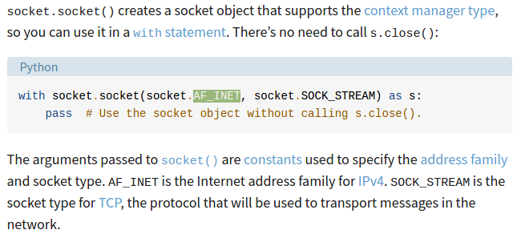
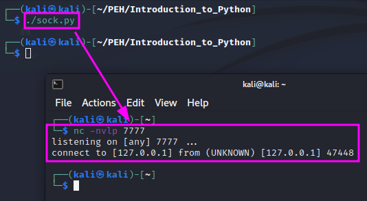
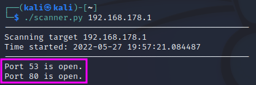

Introduction to Python
======================
This is part of the "Introduction to Python" module of TCM Sec's "Practical
Ethical Hacking" course. I have left out most of the material, which covers a
basic introduction to Python. The rest is an application of Python for network
programming.

.. more::

Sockets:
--------
Sockets are used to connect two nodes. They are used to connect an IP address
to an open port.

.. code:: python

   #!/bin/python3
   import socket

   HOST = "127.0.0.1"
   PORT = 7777

   s = socket.socket(socket.AF_INET, socket.SOCK_STREAM)
   s.connect((HOST, PORT))

The meaning of the parameters ``socket.AF_INET`` and ``socket.SOCK_STREAM`` is
explained in this article on socket programming by `Real Python
<https://realpython.com/python-sockets/>`_:

We can now use the Linux tool ``nc`` (netcat) to listen for incoming traffic on
the chosen port (7777) of our localhost with ``nc -nvlp`` and get the following
if we then start our script:

Building a Port Scanner:
------------------------
The following Python code provides a functional, but not very nice port
scanner. It shall demonstrate what can be done with Python using the ``socket``
module.

.. code:: python

   #!/bin/python3

   import socket
   import sys

   from datetime import datetime

   # Define your target
   if len(sys.argv) == 2:
       target = socket.gethostbyname(sys.argv[1]) # Translate hostname to IPv4
   else:
       print("Invalid amount of arguments!")
       print("Syntax: python3 scanner.py <ip>")

   # Add a pretty banner
   print("-" * 50)
   print("Scanning target " + target)
   print("Time started: " + str(datetime.now()))
   print("-" * 50)

   try:
       for port in range(50, 85):
           s = socket.socket(socket.AF_INET, socket.SOCK_STREAM)
           socket.setdefaulttimeout(1)
           result = s.connect_ex((target, port)) # Returns an error indicator
           if result == 0:
               print(f"Port {port} is open.")
           s.close()
   except KeyboardInterrupt:
       print("\nExiting program")
       sys.exit()
   except socket.gaierror:
       print("Hostname could no be resolved.")
       sys.exit
   except socket.error:
       print("Could not connect to server.")
       sys.exit()

``sys`` is imported to get access to the command line arguments, specifically
to read the target's IPv4 address or hostname. ``datetime.datetime`` is
imported to print a nice banner when the script starts. Finally, ``socket``
is used to establish network connection to different ports on the target to
test whether they are open or not.

``socket.gethostbyname`` is an extra step that translates a hostname, e.g.
``www.google.com`` into an IPv4 address. If the number of command line
arguments is not 2 (i.e. the script name plus the target IPv4 address or
hostname), an error message will be displayed.

In the ``try/except`` block, the script tries to run the code in the ``try``
block. If an error occurs, the respective error is caught in one of the
``except`` blocks below to make sure that the problem is treated correctly. The
range of ports is limited to the range from 50 to 85 and the timeout duration
is set to 1 second to keep the script reasonably fast. The range of possible
ports is otherwise from 1 to 65535, which is not practical if the ports are
scanned one after the other.

``s.connect_ex`` returns an error indicator: if a port is open, the result will
be 0. If a port is not open, it will return 1.

The error handling in the ``except`` clauses is still very basic. If the scan
is interrupted, e.g. by Ctrl + C, an error message is displayed and
``sys.exit()`` is used to leave the script in a clean manner. If the hostname
cannot be resolved with DNS, a ``gaierror`` will be thrown, and we will again
exit the program cleanly after displaying an error message. Finally, if the
connection to the socket cannot be established, this socket error will be
handled in an analogous way.

The script is not very efficient because it scans one port after the other
rather than scanning several ports in parallel using threading. Running the
script with my router's IPv4 address as the target shows that ports 53 and 80
are open in the specified port range:

For fault finding, one could add a ``print`` command into the ``for`` loop to see
how the scan makes progress and if the open ports are actually found.

.. author:: default
.. categories:: none
.. tags:: none
.. comments::
