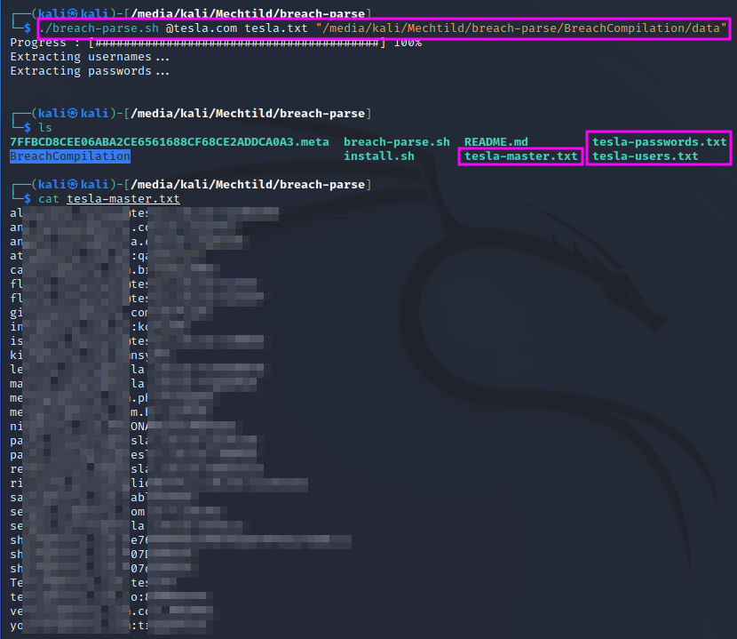

Gathering Breached Credentials with Breach-Parse
================================================
Finding user names and passwords in breached credentials is a very important
step and part of every pentest.

.. more::

TCM offers a bash script on his github page that can be used to filter a
database with compromised user credentials for a specific domain name, e.g.
``@tesla.com``. The results of this filtering can then be used to log in to
a target host.

The database with breached credentials is more than 40 GB in size. It has to be
downloaded from a torrent first, e.g. using ``rtorrent``, which can be
installed with ``sudo apt-get install rtorrent`` in Kali Linux. The torrent
file is then downloaded with ``rtorrent '<torrent link>'``.

The breached credentials are stored in multiple folders, which are traversed
and scanned for the host domain, e.g. ``@tesla.com``. The second command line
parameter serves as the basis for the output file names. If the ``breach-parse``
git is not cloned into the ``/opt`` folder, you have to specify the location of
the credentials as the third command line parameter.

In my case, I have used an old external harddisk (still with a mini USB
connector) to store the huge amount of data. Running the script once to extract
the ``@tesla.com`` credentials took about 45 minutes!

The results are stored in three files: one with only the usernames, one with
only the passwords and one with username/password pairs, where username and
password are separated by a colon.

The user credentials often stem from data breaches into services for which 
people used their company credentials as login credentials. TCM suggests to
look for repeat offenders and to double-check the email address format against
the format that has been identified in the email address hunting step. One can
also look for similarities if several similar passwords show up for one email
address. Perhaps the password has only been altered slightly, e.g. by changeing
the capitalization. This kind of using known user names/email addresses and
passwords is called **credential stuffing**. If this attempt is not successful,
one can still try **password spraying**: trying arbitrary passwords against all
user names in the search results.

.. author:: default
.. categories:: none
.. tags:: none
.. comments::
