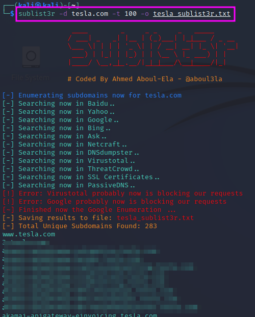
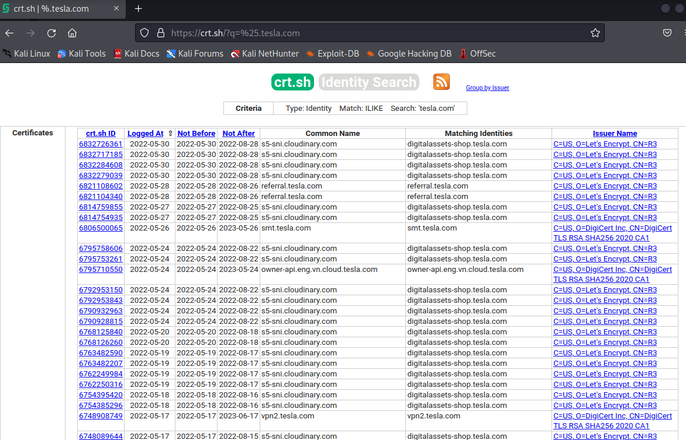
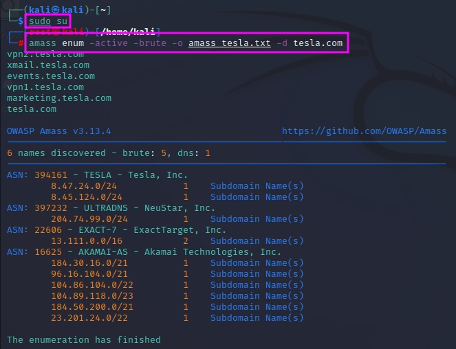
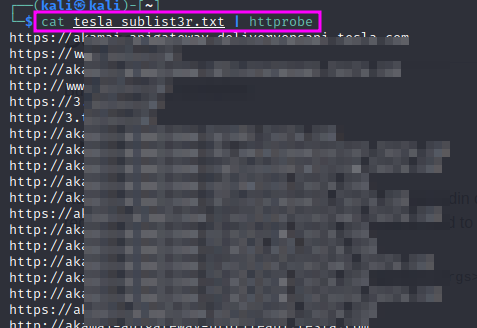

Hunting Subdomains (Parts 1 and 2)
==================================
One of the first steps in reconnaissance is to find out which subdomains belong
to the target. One reason is that one might find subdomains which should not be
publicly accessible, e.g. ``dev.tesla.com``, another reason is that it gives us
a chance to attack multiple websites and not only one.

.. more::

A tool that can be used for these purposes is ``sublist3r``, which crawls a
couple of search engines and databases to find known subdomains that match the
entered root domain. ``sublist3r`` can be installed with
``sudo apt-get install sublist3r``. To make the scan faster, one can use multiple
threads with the ``-t`` command line switch. The output can be written to a file
using the ``-o`` command line switch, e.g. ``sublist3r -d tesla.com -t 100 -o
tesla_sublist3r.txt``

Another `service <https://crt.sh/>`_ that can be used to list subdomains is
``crt.sh``. You can enter a domain name, using ``%`` as a wildcard, and the
database will list all subdomains for which certificates have been issued.
These can be 3rd and 4th level subdomains.

TCM recommends to look for ``dev``, ``test``, ``sso``, ``stage``, for mail
servers and perhaps also for clues as to which tools are used on the target.

Finally, a popular tool among bug-bounty hunters is OWASP's ``Amass`` tool
that can be cloned from `github <https://github.com/OWASP/Amass>`_. However, it
was already installed on my version of Kali Linux. I could not get proper results
when I tested ``Amass`` in ``intel`` mode. After some trying, I believe that I
still need to set up the ``config.ini`` file correctly, especially add
credentials to use the APIs that the program uses. This seems to be a task that
requires some diligence. I will postpone that until later. Youtube videos might
help.

To check whether the found subdomains are alive, one can run the found domains
through a tool called ``httprobe``, which is preinstalled on my Kali Linux. It
can also be downloaded from a github `repository <https://github.com/tomnomnom/httprobe>`_.
``httprobe`` is used as a filter that prints only those entries in a text file
which are active website: ``cat <subdomain file list> | httprobe``.

.. author:: default
.. categories:: none
.. tags:: none
.. comments::
