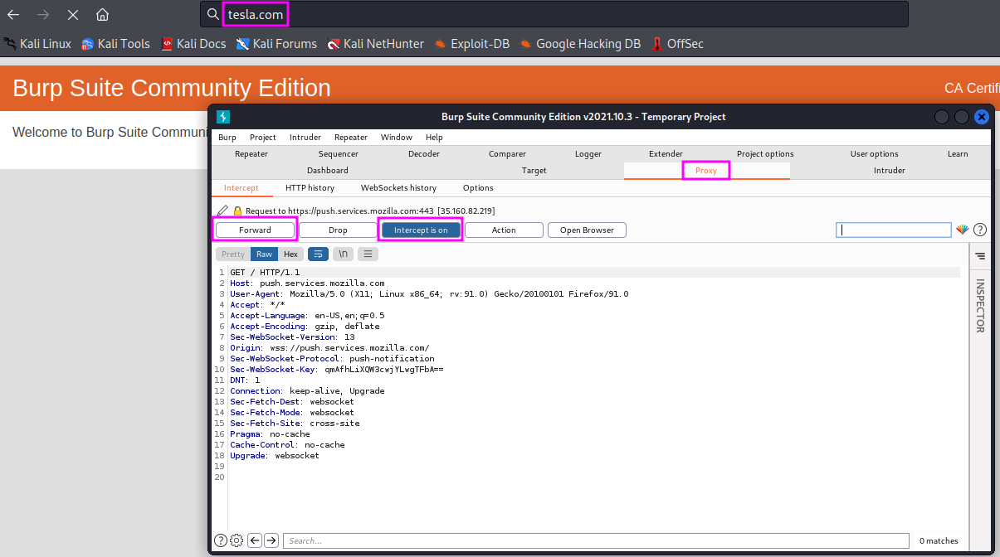

Information Gathering with Burp Suite
=====================================
Burp Suite is a web proxy. It can intercept web traffic for us. The Community
Edition has a limited functionality, one can only select ``Temporary Project``
upon startup, then click on ``Start burp`` (using the Burp defaults).

.. more::

To create some web traffic, we will then start a web browser, e.g. ``Firefox``,
where we change the preferences for the proxy configuration to an HTTP proxy
with IP address 127.0.0.1 (localhost), port 8080, which we use for all
protocols (click checkbox!). After that, we open a new browser tab and open
the web address ``https://burp``. On that page, we click on ``CA Certificate``,
save the certificate on our disk and load it into the browser under
``Settings``, ``Privacy and Security``, and ``View Certificates``, then select
the certificate in the ``Downloads`` folder.

To see Burp Suite in action, open a website, e.g. ``www.tesla.com``. The
website will not open, the browser will freeze. Looking at ``Burp Suite``, we
will find that the ``Proxy`` tab is highlighted, and ``Burp Suite`` is waiting
for the user to decide what to do with the captured HTTP request (probably a
``GET`` request).

If we decide to send the request to the ``tesla.com`` server by clicking
``Forward``, the next request will soon end in the ``Proxy`` waiting to be
decided upon by the user. One can also switch back to normal browser behaviour
by deactivation of the interception mode (click on ``Intercept is on``).

We can also change requests directly in the ``Proxy`` tab before we forward
them to the server. That gives us full control over the communication between
web browser and target host.

On the ``Target`` tab, we can get an overview of the sent requests sorted by
host and location on the host, as well as the responses to the respective
requests. This allows us to draw a lot of conclusions, such as software versions
(``PHP`` and ``Drupal`` versions) and the structure of server names, which can
be helful further down the road when we are enumerating vulnerabilities, if we
haven't found the information elsewhere before. This is all passive scanning.
``Burp Suite`` also has an active scanning feature, but that is only available
in the professional paid version (approximately 400 USD per year, according to
TCM, who highly recommends the pro version).

After we are finished with the ``Burp Suite`` traffic analysis, we should
switch the proxy settings in our browser back to their previous value.

.. author:: default
.. categories:: none
.. tags:: none
.. comments::
