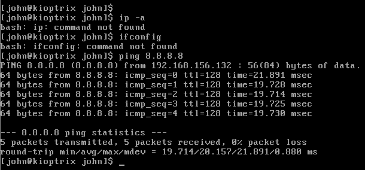
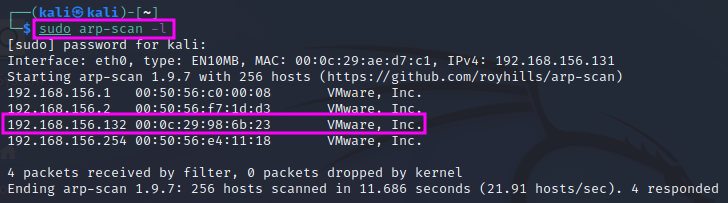
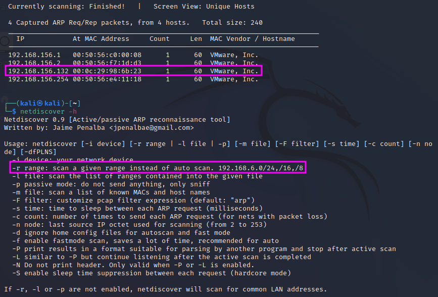
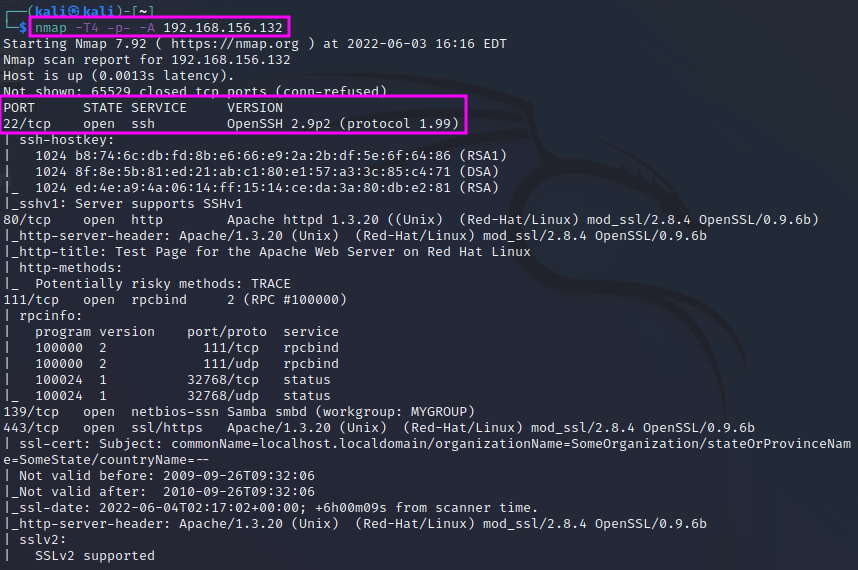
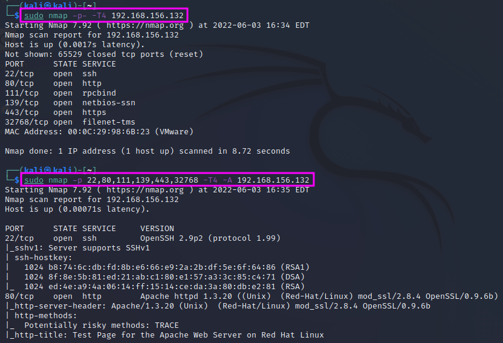

Scanning with Nmap
==================
In this section, we will learn how to use ``Nmap`` to scan a target machine for
open ports and services running on the machine that can be exploited in the
following step.

.. more::

The Kioptrix machine is already quite old, therefore ``ip`` and ``ifconfig``
are not available on that machine. However, to get to know the IP address of
the Kioptrix machine, we can simply use the ``ping`` command, e.g. ``ping
8.8.8.`` (or any other IP address, does not matter), and we will see the IP of
the Kioptrix machine.

We can see that in the setup shown above, the IP address was
``192.168.156.132``.

We can also use a tool installed on Kali Linux named ``arp-scan``. With the
command switch ``-l`` or ``-localnet``, the target IP address range is
generated from our local network interface configuration (network IP address
and network mask). ``arp-scan`` has to be executed as ``sudo``. We need to look
for IP addresses that relate to ``VMWare, Inc.``.

In the 2019 version of the video, TCM used a tool called ``netdiscover``. This
tool is also installed under Kali Linux and works just as well as ``arp-scan``.
Again, one has to start it with ``sudo``, e.g. ``sudo netdiscover -r
192.168.156.0/24`` where the ``-r`` switch defines the scan range in ``CIDR``
notation.

The ``Nmap`` tool uses an interrupted 3-way handshake to scan for open ports and
services. Instead of the ususal ``SYN`, ``SYN/ACK`` (in case the ``SYN`` has
been sent to an open port before), ``ACK`` process, it resets the request t
o establish a network connection sending an ``RST`` packet in return to the
``SYN/ACK`` message. This resets the request. Thereby we can identify that the
port is open, even though we do not actually establish a connection.

There used to be a "stealth" mode for Nmap that could be invoked with ``nmap
-sS``, but this mode is not stealthy any more today. Modern intrusion detection
systems (IDS) will detect the scan safely, but TCM reports that less than 80%
of the scans get detected, because not every administrator uses an IDS.

We will use the ``nmap`` command with the following switches: ``nmap -T4 -p-
-A <IP address>``. The ``-T4`` parameter determines the scan speed, running from 1 (slow) to
5 (fast). The slower the scan, the lower the chances of being detected. The
switch ``-p-`` means that all ports (1-65535) shall be scanned. Without the
``p``switch ``nmap`` will just scan the top 1000 ports, which are the most
commonly used ones, but we could miss a service. One can also scan specific
ports, e.g. with ``nmap -T4 -p 80,443,53 -A``. The ``-A`` parameter means that
``nmap`` will tell us all available information, including, e.g. version
information, operating system, etc.

The most important parameters that we need to know are ``-sS`` for stealth mode
and ``-sU`` for a UDP scan (default is TCP). These will cover 99% of our use
cases, according to TCM. UDP also covers 65535 ports. Since UDP is a
connectionless protocol, the response times can be much longer than for TCP,
and therefore an entire scan can take very long time. TCM therefore recommends
to just scan the top 1000 ports: ``nmap -sU -T4 -p <IP address>``.

It is usually much faster to run a scan with ``-p-`` first and leave the ``-A``
switch, which tells ``nmap`` to deliver the maximum available information, out.
Once we have seen which ports are open in the first scan (without ``-A``), we
can do a second scan with the ``-A`` switch but limit the scan only to the
ports that were found open. This procedure can also be automated with a script.
However, this is not really necessary since an ``nmap`` scan is among the first
things that one does in a pentest, and while the scan runs one can just as well
spend the time on OSINT exercises, such as looking for breached credentials or
scanning for information on social media.

.. author:: default
.. categories:: none
.. tags:: none
.. comments::
