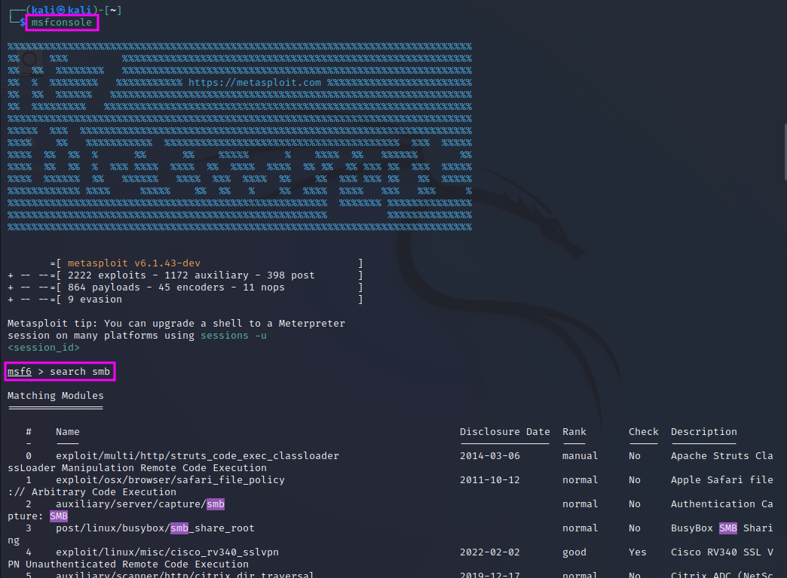
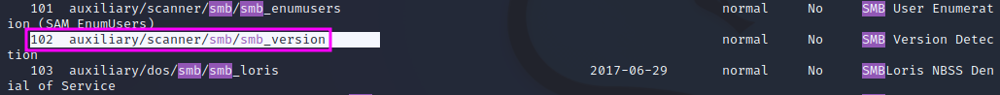
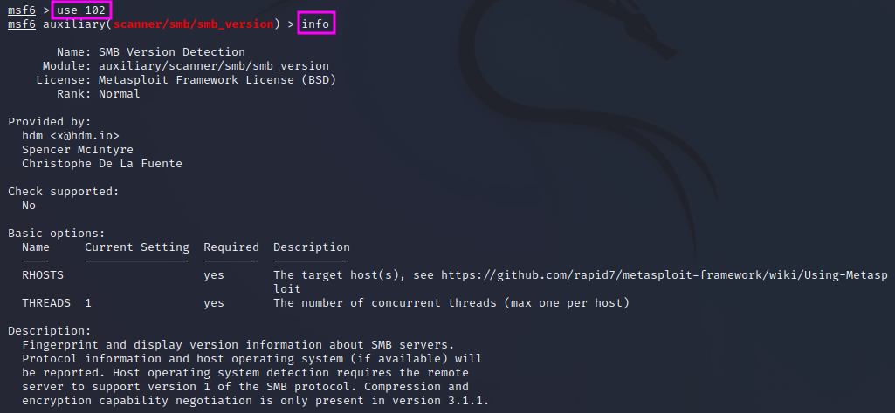
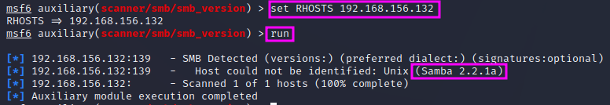
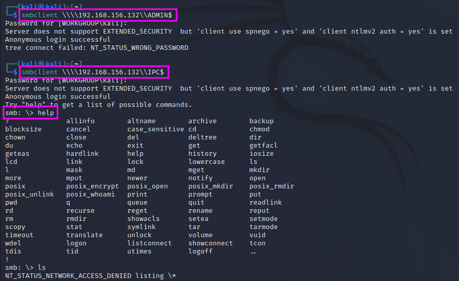

Enumerating SMB
===============
SMB (Server Message Block) is a file-sharing protocol used in networks to up-
and download files to a shared folder. SMB is typically used in work and
internal environments.

.. more::

In our Kioptrix pentest, the ``nmap`` scan revealed that a Samba server was
accessible on the open port 139, and the workgroup name was ``MYGROUP``. The
scripts part of ``nmap`` revealed that the Samba version was probably ``SMB2``,
but we do not know the exact version yet, which would be valuable for an
exploit. We can also try to connect to the SMB service and try to get access to
files that contain valuable information.

We will use a tool called ``MetaSploit`` to get more information on the SMB
version and to try to exploit it. We can start it by entering ``msfconsole`` on
the command line. ``MetaSploit`` is very powerful. It offers tools for
enumeration, exploitation and the post-exploitation stage as well. It has quite
some learning curve, but it will be one of the most used tools for pentesters
in the field.

To find the available tools for SMB enumeration and exploitation we can simply
search for the term "smb" on the ``MetaSploit`` command line with ``search
smb``. This will yield a very long list of available features (here: 131 hits!),
from which we can pick one either by name or by id. The features are grouped by
categories, which is helpful to find the sought functionality. In this case we
are looking for a scanner for the SMB version, which we find under id 131.

We can load this module now typing either ``use
auxiliary/scanner/smb/smb_version`` or ``use 102``, using the id. The
``MetaSploit`` command line prompt will then show that the respective module is
active now. We can get some information about the usage of the module if we
type ``info``. 

There are two options that we need to set before we can start the enumeration,
``RHOSTS`` and ``THREADS``, which has a default value of 1 and thus does not
necessarily need to be set. ``RHOSTS`` in plural form means that we can assign
a range of IP addresses in CIDR notation or just a single IP address, whereas
``RHOST`` would accept only a single IP address. In our case, we can set the
values with ``set RHOSTS 192.168.156.132``, followed by ``run`` to actually
start the scan.

The scan shows that the Samba server is version 2.2.1a, and we can use this now
to search on the internet or our hacking tools whether we can find an exploit
for this Samba version. This is an important finding that we should add to our
pentest report. If one has gathered a lot of detailed information in the
reconnaissance and enumeration phase, the exploitation is a rather easy part,
according to TCM.

The next tool is called ``smbclient``. It will try to connect to the file
share. We can even try to do this anonymously. The command ``smbclient -L
\\\\192.168.156.132\\`` will connect to the SMB service, and the ``-L`` flag
tells the program to list all shares. When we are asked for a password, we can
try to just hit enter. As a result, we get a list of the shares: ``IPC$`` and
``ADMIN$``. We can then try to connect to these two shares directly and leave
the ``-L`` switch away.

We find that we cannot get access to the ``ADMIN$`` share without a password,
but we get access to ``IPC$``. However, we cannot execute any commands once we
are logged in anonymously, therefore this is also a dead end for now, and we
can just exit the smb server with ``exit``.

.. author:: default
.. categories:: none
.. tags:: none
.. comments::
