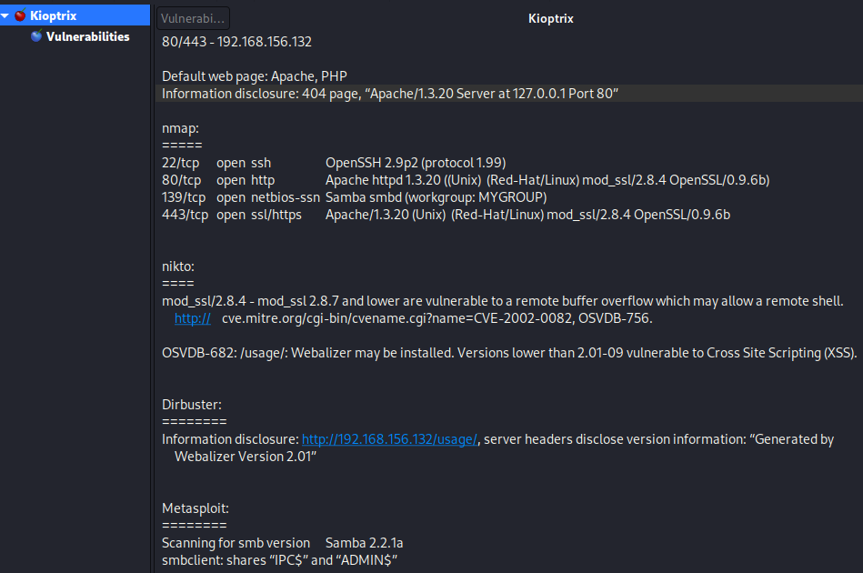
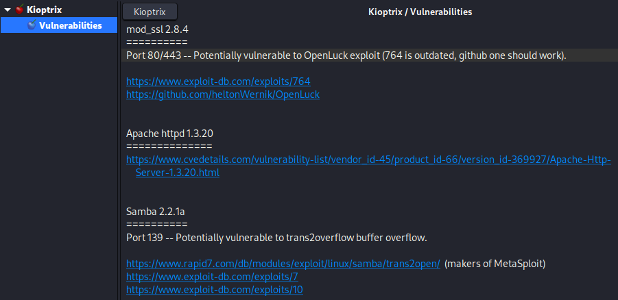
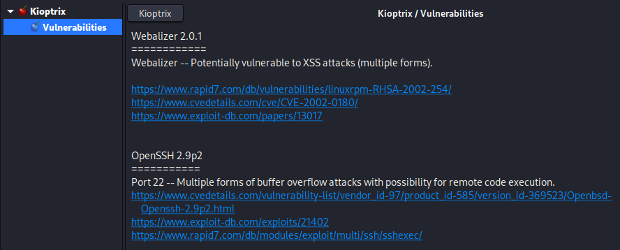

Researching Potential Vulnerabilities
=====================================
This blog is about identifying and researching potential vulnerabilities,
starting from the results that we have found for Kioptrix so far.

.. more::

See the screenshots from the pentest report that I have put together on the
Kali machine:

Based on these enumerations, we have just searched for the respective services
plus "exploit" on Google. The results have been evaluated briefly and collected
on a separate sheet as a collection of possible vulnerabilities:

TCM also points out that one can use a locally installed database to search for
vulnerabilities if an internet connection is not possible: ``searchsploit``
scans the ``Exploit Database`` that is downloaded onto the local machine with
every update. It can be used with a search term and will deliver a list of
matching results:

.. image:: searchsploit.png
   :scale: 80%

The entry that I have highlighted is actually not applicable since our target
machine runs on Linux, but the entry refers to OSX. The one below seems better
suited.

Webalizer and SSH were left as exercises here.

.. author:: default
.. categories:: none
.. tags:: none
.. comments::
