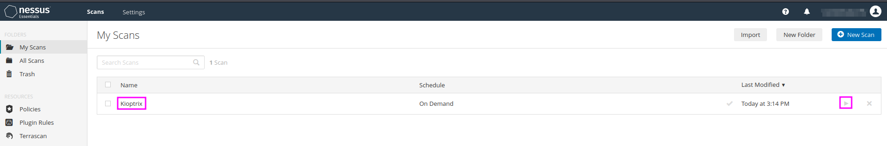
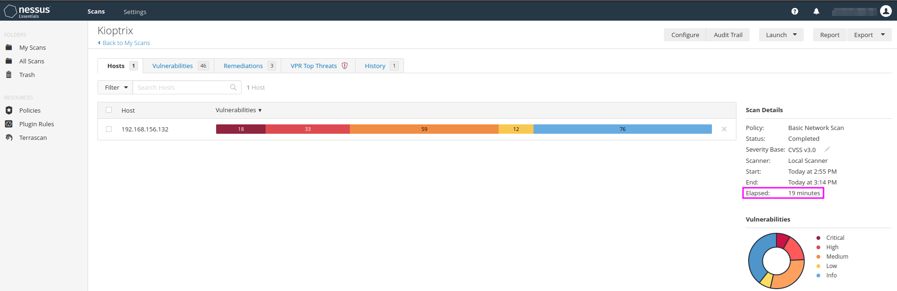

Scanning with Nessus
====================
``Nessus`` is a vulnerability scanner, a tool that is frequently used in
penetration testing. It might even be the first tool that one uses in an
external assessment.

.. more::

Part 1
------

Once ``Nessus`` has been downloaded and installed (``dpkg -i Nessus...deb``,
follow the instructions at the end, then chose the "Nessus Essentials"), we will
typically use the **Basic Network Scan** and the **Advanced Scan**. The free
edition can scan against any private IP address (up to max. 16 scans at a time,
but no external scans).

We set the port scan range to ``all port`` under ``Discovery/Scan Type`` and
the scan type to ``Scan for know web vulnerabilities``. We leave everything as
the default settings and save the settings, before we finally start the scan
with the play button in the overview ``My Scans``.

The scan of the Kioptrix machine took approximately 20 minutes and delivered a
good number of results, among them 2 critical ones,  that we had gathered
manually before using a couple of other tools.

With the **Advanced Scan** one has in the first place more control over details
that were predefined in the **Basic Network Scan**. TCM recommends to start
with the Basic Scan on Kioptrix and then to play with the settings of the
Advanced Scan to see what difference the individual settings bring about.

Part 2
------
To get the results displayed with more granularity we can click on the settings
button in the upper right corner of the results table and click on ``Disable
groups``. Then we can sort the vulnerabilities by severity and pick the top few
to put into our report (..., and use even the middle or low severity if there
is nothing else to report to our client).

.. image:: Nessus_Kioptrix_results.png
   :scale: 42%

We can see that ``Nessus`` has detected a lot of critically severe
vulnerabilities, all related to OpenSSL, OpenSSH and the Apache server.
``Nessus`` does not only report the vulnerability and its severity, but it also
includes suggestions for remedies that can be applied to fix the vulnerability.
The report can be downloaded and converted into an ``Excel`` file that we can
give to the client.

In any case, we should double-check the scan results, i.e.
if ``Nessus`` reports to have found, e.g. ``Open SSL 0.9.6b``, we must verify
this manually with a direct connection to the service. We should not rely only
on an automated scan, even though it is very helpful in making sure that we do
not forget any potential vulnerabilities.

TCM reports that he pays for two tools for pentesting: ``Nessus`` and
``BurpSuite Pro``.

.. author:: default
.. categories:: none
.. tags:: none
.. comments::
