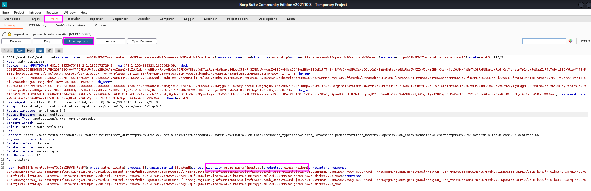
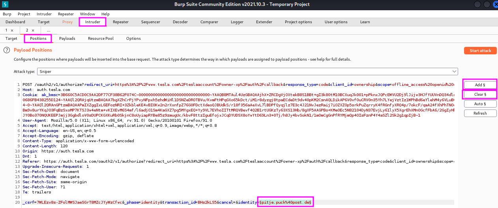

Credential Stuffing and Password Spraying
=========================================
**Credential stuffing** means taking breached credentials (e.g. from Breach
Parse or website like ``weleakinfo.to`` -- before it was seized by law enforcement)
and trying to use them to log in to an account on a target.

.. more::

The art of credential stuffing is taking the list of user names and passwords
and throwing them at a website.

First, we are going to install a proxy plugin
for Firefox called ``FoxyProxy``. FoxyProxy will make it easier for us to
switch a proxy on for use with ``Burp Suite``. To this end, we add a new proxy,
name it ``Burp Suite`` and the the ``Proxy Type`` to ``HTTP`` and the proxy IP
address and port to ``127.0.0.1`` and ``8080``. Then we save the settings,
which allows us from now on, to switch the proxy on with just a click on the
fox in the upper right corner of our ``Firefox`` window.

This tool will make our work with ``Burp Suite`` more convenient in the future
since we do not have to switch the proxy on and off in the settings menu any
more. Now we can just start ``Burp Suite`` as usual, go to the ``Proxy`` tab
and go to some website to see that we are now intercepting the web traffic as
planned. (Just refreshing the current site did not work on my machine!)

With this preparation we go to the Tesla website and search for the login
menu. When we have found it and passed the captcha test, we switch to
interception mode to make sure that we capture the package with the fake login
name and password that we are about to enter.

When we have found our fake login attempt in ``Burp Suite``, we right-click
into the message and chose ``Send to intruder``. Then we go from the ``Proxy``
to the ``Intruder`` tab and click first on ``Positions`` tab, followed by the
``Clear §`` button to remove the highlighted, auto-detected items and select the
ones that apply for our purpose manually. To do that, we select first the email
address that we have used (e.g. ``pitje.puck``) and click ``Add §``, then we do
the same with the password that we used for fake login account. When I did this
a second time and was not asked for the Captcha process, the HTTP request was
different from the first attempt, see below. I am not sure what to make of
this, maybe this splitting of user name and password will already prevent this
kind of automated credential stuffing.

I will not follow the rest of the procedure demonstrated in this video since (a)
Tesla apparently recognizes and blocks traffic from a VPN service and (b) TCM
recommended against it to be sure that we do not risk any legal issues if Tesla
changed the conditions for their bug bounty program. Here is what the next
steps of this credential stuffing attack with ``BurpSuite`` look are:

Next, we select the ``Attack type``. The ``Sniper`` type uses only one
parameter, whereas we want to use two, user name and password, therefore we
chose ``Pitchfork``. After that, we move over to the ``Payloads`` tab and
copy/paste or load our user name and password lists into the web mask, setting
the ``Payload set`` to ``1`` for the user names (selected first in the previous
step), followed by the same procedure with the breached passwords for ``Payload
set 2``. The ``Payload type`` is set to ``Simple list`` for both lists. The
numbers of user names and passwords should be the same now, so that
``BurpSuite`` can use them in pairs and replace the selected parameters in the
captured HTTP request one pair after the other. When this is all set up properly,
we can click on ``Start attack`` in the upper right corner.

When the attack runs, we watch out for HTTP status code changes, e.g. from 200
to 301, which represents a redirect, or the length of the reply changes
notably. We can also select one result and look at the response to our HTTP
request to check if there is any textual clue like "We could not sign you in",
which we can copy and use for a text filter when we go back one step and click
on the ``Options`` tab. We can first remove all other keyword filters and then
add our own, which will result in an additional checkbox column during the scan
indicating whether our phrase has been found in the response or not. When the
scan is finished, we can sort our results by this checkbox column and find the
ones where the phrase did not occur, which will then hopefully be our
successful logins.

**Password spraying** works in a similar fashion: we use a list of known user
names again, e.g. from ``hunter.io``, ``Linkedin`` and other OSINT sources, and
scan them versus a fixed password that we edit manually in the captured HTTP
package. When we chose our password wisely, we may be able to find users that
have chosen that password. The advantage is that we do not necessarily have
access to breached credentials, only to user names.

The downside of this approach when we are trying to break into ``Active
Directory`` accounts is that the server might automatically log the respective
user out after a certain number of failed login attempts. In a pentest, it is a
good idea to check with the customer how many attempts can be made before a
user is locked out to prevent that several users cannot log in to their account
any more or we even cause a denial of service. One can also run just single or
double rounds and wait a few hours after these rounds.

To run the attack, we change the attack mode to ``Sniper`` because we want to
scan only a single parameter, the user name. Otherwise, the rest works the same
way as credential stuffing. We look for the HTTP response code, response length
or we filter for a particular text.

Credential stuffing and password spraying are by far the most common ways to
break into networks in an external pentest, followed by using default
credentials, but not so much vulnerability exploits.

TCM warns of vulnerabilities that bad actors may well have found before us
since they are constanly scanning the web for vulnerabilities. He also
stresses the importance of reconnaissance again to find the necessary data to
launch a credential stuffing/password spraying attack with ``BurpSuite``. TCM
says that once you are inside a network, the internal attack is often rather
easy.

.. author:: default
.. categories:: none
.. tags:: none
.. comments::
